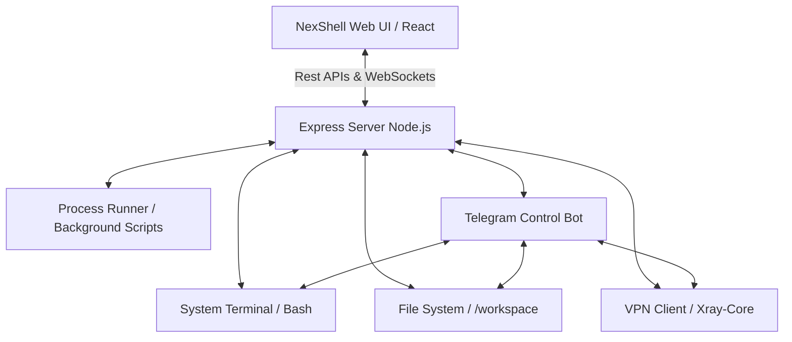

#  NexShell &mdash; ServerDash

> **Ultimate Web Terminal, Intelligent File Explorer, Integrated Telegram Bot, Background Process Runner & VPN Tunneling Suite**  
> یک پنل مدیریت وب‌سرور پیشرفته، سبک و تمام‌عیار بر پایه **Node.js (Express)** و **React (Vite + Tailwind CSS)** همراه با پایش بلادرنگ، کلاینت شبکه هوشمند (Xray/VPN) و بات تلگرام اختصاصی کنترل همه‌جانبه سرور.

<p align="center">
  
  
  
  
  
</p>

---

## 🗺️ نمای کلی معماری سیستم (System Architecture)



---

## ⚡ ویژگی‌های برجسته و قابلیت‌های کلیدی پنل

<div align="right" dir="rtl">

| بخش / قابلیت | توضیحات کاربردی و ویژگی‌های تعبیه‌شده | دسته‌بندی و ماژول |
| :--- | :--- | :--- |
| 🖥️ **ترمینال زنده وب (Interactive Shell)** | اجرای بلادرنگ دستورات لینوکس (Bash) با شبیه‌ساز حرفه‌ای Xterm.js و کلیدهای میانبر نظیر `Ctrl+C` و `Ctrl+L`. | هسته اصلی |
| 🤖 **بات تلگرام یکپارچه (Telegram Bot)** | کنترل و مدیریت سرور از راه دور! اجرای دستورات، تغییر وضعیت VPN، مانیتورینگ سیستم و دانلود فایل از تلگرام. | ماژول تلگرام |
| 📂 **مدیریت فایل هوشمند** | ساخت، حذف، دانلود/آپلود هوشمند (Drag & Drop)، تغییر دسترسی‌ها (`chmod`) و ویرایش پیشرفته با ادیتور کد متنی. | مدیریت فایل |
| 📦 **عملیات گروهی فایل‌ها** | قابلیت **انتخاب چندگانه (Multi-select)** برای دانلود یا حذف گروهی فایل‌ها با فیلترینگ خودکار تداخل‌ها. | مدیریت فایل |
| 🌐 **مدیریت هوشمند VPN** | کلاینت داخلی قدرتمند مجهز به هسته **Xray-core** با پشتیبانی از پروتکل‌های **VLESS, VMESS, Trojan, Shadowsocks** جهت اجرای پردازش‌ها تحت پروکسی. | شبکه و امنیت |
| 🚀 **توسعه و به‌روزرسانی سریع (Deploy)** | آپلود مستقیم فایل‌های پروژه یا **دپلوی آسان از گیت‌هاب** با استخراج خودکار ZIP و نصب بسته‌های پیش‌نیاز. | ابزار توسعه |
| ⚙️ **مدیریت پردازش‌های پس‌زمینه** | اجرای پروژه‌ها و اسکریپت‌های پایتون/نود با نظارت زنده بر لاگ‌ها، قابلیت توقف/راه‌اندازی مجدد و توقف امن فرآیندهای یتیم. | کنترل فرآیندها |
| 📊 **پایش برخط منابع (Monitoring)** | مانیتورینگ زنده و گرافیکی مصرف پردازنده (CPU)، حافظه (RAM)، دیسک سرور و پهنای باند شبکه با نمودارهای پویای Recharts. | سیستم و لاگ |
| 📜 **فیلتر لاگ‌های سیستمی** | نمایش لاگ‌های کل پنل با قابلیت دسته‌بندی و فیلترینگ هوشمند سطوح خطا نظیر عمومی (`INFO`)، هشدار (`WARN`) و بحرانی (`ERROR`). | سیستم و لاگ |
| 🌐 **پشتیبانی دو زبانه کامل** | بومی‌سازی کامل پنل و تمامی پیام‌ها و منوها به دو زبان **فارسی** و **انگلیسی** برای استفاده راحت‌تر. | تجربه کاربری |

</div>

---

## 🤖 بات تلگرام مدیریت سرور (Integrated Telegram Control Bot)

<div align="right" dir="rtl">

یکی از پیشرفته‌ترین بخش‌های پنل NexShell، **بات اختصاصی تلگرام** است که به شما امکان می‌دهد سرور لینوکس خود را بدون نیاز به ورود به وب‌سایت کنترل کنید:
* **فعال‌سازی و تنظیم آسان:** کافیست از تب اختصاصی تلگرام در پنل، `Token` بات تلگرامی و `Admin ID` خود را وارد کرده و بات را با یک کلیک روشن کنید.
* **بررسی وضعیت و تغییر پروکسی:** خاموش و روشن کردن VPN سرور و بررسی وضعیت اتصال و آی‌پی فعال سیستم به صورت مستقیم از داخل تلگرام.
* **دریافت وضعیت سرور:** مشاهده آمار لحظه‌ای مصرف رم، سی‌پی‌یو و فضای دیسک با پیام‌های گرافیکی و منظم.
* **مدیریت فایل‌ها و پردازش‌ها:** مشاهده اسکریپت‌های در حال اجرا و امکان دانلود مستقیم فایل‌های سرور روی تلگرام شما.

</div>

---

## 🌐 مدیریت VPN و تونلینگ سرور (Xray & Proxy Tunnel)

<div align="right" dir="rtl">

داشبورد NexShell مجهز به یک سیستم هدایت ترافیک هوشمند است:
* **پشتیبانی از پروتکل‌های مدرن:** پشتیبانی کامل از پروتکل‌های پرسرعت مانند `VLESS (Reality / gRPC / TCP)`، `VMESS`، `Trojan` و `Shadowsocks` از طریق وارد کردن لینک‌های اشتراک یا کانفیگ تکی.
* **تونلینگ انتخابی با Proxychains:** پنل از ابزار قدرتمند `proxychains4` بهره می‌گیرد تا به صورت انتخابی یا سراسری، پردازش‌های پس‌زمینه لینوکس، اسکریپت‌های پایتون و دانلودرهایی چون `yt-dlp` را از بستر VPN فعال‌شده عبور دهد.
* **بررسی زنده آی‌پی (IP Checker):** با یک کلیک می‌توانید آدرس IP فعلی سرور و لوکیشن جغرافیایی آن را قبل و بعد از اتصال VPN بررسی کنید تا از تغییر موفق آی‌پی مطمئن شوید.

</div>

---

## 📦 سیستم دپلوی و به‌روزرسانی پروژه (Deploy & Auto-Extraction)

<div align="right" dir="rtl">

برای توسعه‌دهندگان، ابزارهای ویژه‌ای جهت استقرار پروژه‌ها تعبیه شده است:
* **دپلوی مستقیم از GitHub:** کافیست لینک مخزن گیت‌هاب (یا لینک دانلود فایل ZIP) را وارد کنید؛ پنل فایل‌ها را دانلود، استخراج و به صورت خودکار جایگزین می‌کند.
* **نصب خودکار پیش‌نیازها:** پس از دپلوی، پنل وجود فایل `requirements.txt` را بررسی کرده و وابستگی‌های پایتونی را با استفاده از فلگ‌های امن و بهینه نصب یا به‌روزرسانی می‌کند.
* **توقف امن پردازش‌های قبلی:** هنگام به‌روزرسانی اسکریپت‌ها، سیستم برای جلوگیری از تداخل و اشغال منابع، تمام فرآیندهای فرزند و درخت فرآیندی مرتبط با شناسه (PID) قبلی را به طور کامل پاکسازی می‌کند تا هیچ پردازش یتیمی باقی نماند.

</div>

---

## 🛠️ پیش‌نیازها و بسته‌های نصب‌شده (System Stack)

پروژه برای پایداری در محیط‌های کانتینری و پشتیبانی از انواع اسکریپت‌های پردازشی به بسته‌های زیر مجهز شده است:

### 📦 بسته‌های لینوکس (`Apt-Get`):
* `python3` & `python3-pip` — جهت اجرای اسکریپت‌های پس‌زمینه و مدیریت بسته‌ها
* `ffmpeg` — برای پردازش، فشرده‌سازی و دانلود فایل‌های مالتی‌مدیا
* `proxychains4` — به منظور تونل کردن ترافیک دستورات تحت ترمینال
* `curl`, `unzip`, `tini`, `procps` — برای مانیتورینگ منابع و وظایف پایه لینوکس

### 🐍 پکیج‌های پایتون (`requirements.txt`):
* **دانلودرها و هوش رسانه‌ای:** `yt-dlp` | `gallery-dl` | `streamlink` | `instagrapi`
* **ابزارهای شبکه و سیستم:** `psutil` | `requests` | `aiohttp` | `aiofiles` | `beautifulsoup4`

---

## 🚀 راهنمای راه‌اندازی محلی (Local Setup)

### ۱. دریافت و نصب وابستگی‌های پروژه
کتابخانه‌های فرانت‌اند و بک‌اند پروژه را نصب کرده و پکیج‌های پایتون را مستقر کنید:
```bash
# نصب پکیج‌های بخش Node.js
npm install

# نصب پیش‌نیازهای ابزارهای سیستم (با فلگ مناسب برای توزیع‌های جدید لینوکس)
pip install -r requirements.txt --break-system-packages
```

### ۲. اجرای پروژه در حالت توسعه (Development Mode)
```bash
npm run dev
```
داشبورد روی پورت تعیین شده به آدرس `http://localhost:3000` در دسترس شما قرار می‌گیرد.

### ۳. ساخت بیلد نهایی و اجرا در محیط عملیاتی (Production Build)
```bash
npm run build
npm start
```

---

## 🔐 احراز هویت و اطلاعات ورود پیش‌فرض

برای ورود به داشبورد وب پس از اولین راه‌اندازی، از مشخصات زیر استفاده نمایید:

* **نام کاربری (Username):** `admin`
* **رمز عبور (Password):** `admin123`

> [!WARNING]  
> **توصیه مهم امنیتی:** برای جلوگیری از سوءاستفاده‌های احتمالی، بلافاصله پس از اولین ورود، با کلیک روی **آیکون سپر (تنظیمات امنیتی)** در بالای پنل، نام کاربری و رمز عبور خود را تغییر دهید. هم‌چنین می‌توانید توکن امنیتی اختصاصی خود را مجدداً ایجاد کنید.

---

## 📂 ساختار کدهای برنامه (Project Architecture)

```text
├── server.ts                  # سرور قدرتمند Express مجهز به وب‌سوکت‌ها و APIهای کنترلی
├── telegram_bot/              # دایرکتوری کنترل اتصالات VPN و هسته کلاینت تلگرام
│   ├── telegram_bot.py        # بات تلگرام اختصاصی مدیریت همه‌جانبه سیستم و سرور
│   ├── vpn_manager.py         # موتور کنترل اتصالات Xray-Core و ثبت وضعیت فعال
│   ├── file_manager.py        # فایل منیجر داخلی سیستم تلگرام
│   └── vpn_cli.py             # واسط خط فرمان VPN جهت تعامل محلی با هسته Xray
├── src/
│   ├── App.tsx                # کامپوننت پایه فرانت‌اند، مسیریابی و کنترل دسترسی‌ها
│   ├── components/
│   │   ├── TerminalView.tsx   # واسط گرافیکی ترمینال با کلیدهای سریع و شبیه‌ساز زنده
│   │   ├── FileManager.tsx    # ماژول مدیریت فایل با قابلیت‌های دانلود و حذف گروهی و تکی
│   │   ├── ProcessManager.tsx # سیستم مانیتور، اجرا و توقف امن پردازش‌ها و اسکریپت‌های پس‌زمینه
│   │   ├── TelegramBotManager.tsx # پنل پیکربندی، روشن/خاموش کردن و پایش بات تلگرام
│   │   ├── MonitoringDashboard.tsx # پایش گرافیکی و بلادرنگ رم، پردازنده و ترافیک شبکه
│   │   ├── GithubUploadDeployModal.tsx # ماژول دانلود، دپلوی و استخراج پروژه از گیت‌هاب
│   │   └── LogsViewer.tsx     # فیلترینگ و مشاهده پیشرفته لاگ‌های سیستمی لینوکس
│   └── locales/
│       └── translations.ts    # بومی‌سازی کامل پنل به زبان فارسی و انگلیسی
├── nixpacks.toml              # کانفیگ خودکار دپلوی روی پلتفرم‌های کانتینری
└── Dockerfile                 # کانتینر داکر بهینه برای اجرای ابزارهای شبکه و سیستم
```

---

## ⚖️ لایسنس (License)

این پروژه تحت قوانین لایسنس بین‌المللی **MIT** منتشر شده است و برای هر نوع توسعه تجاری یا شخصی آزاد و رایگان است.
