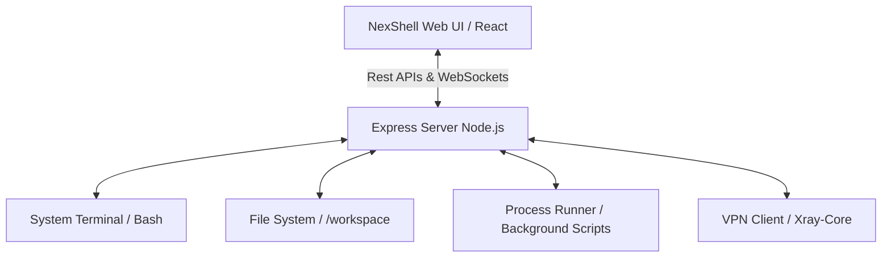

#  NexShell &mdash; ServerDash

> **Ultimate Web Terminal, Intelligent File Explorer, Background Process Runner & VPN Tunneling Suite**  
> یک پنل مدیریت وب‌سرور پیشرفته، سبک و تمام‌عیار بر پایه **Node.js (Express)** و **React (Vite + Tailwind CSS)** همراه با پایش بلادرنگ و کلاینت یکپارچه شبکه هوشمند (Xray/VPN).

<p align="center">
  
  
  
  
</p>

---

## 🗺️ نمای کلی معماری و قابلیت‌ها (System Architecture & Features)



### ⚡ ویژگی‌های برجسته و قابلیت‌های کلیدی پنل

<div align="right" dir="rtl">

| بخش / قابلیت | توضیحات کاربردی و ویژگی‌های تعبیه‌شده | دسته‌بندی و ماژول |
| :--- | :--- | :--- |
| 🖥️ **ترمینال زنده وب (Interactive Shell)** | اجرای بلادرنگ دستورات لینوکس (Bash) با پشتیبانی کامل از کلیدهای میانبر استاندارد ترمینال نظیر `Ctrl+C` برای لغو، `Ctrl+L` برای پاکسازی و اسکرول نرم. | هسته اصلی |
| 📂 **مدیریت فایل هوشمند** | عملیات همه‌جانبه شامل ایجاد فایل و پوشه، دانلود و آپلود آسان (Drag & Drop)، تغییر دسترسی‌ها (`chmod`)، ویرایش فایل‌های متنی با ادیتور کد و جستجوی فایل‌ها. | مدیریت فایل |
| 📦 **عملیات گروهی فایل‌ها** | قابلیت **انتخاب چندگانه (Multi-select)** برای حذف دسته‌جمعی یا **دانلود گروهی فایل‌ها** (سیستم به‌طور خودکار پوشه‌ها را از فرآیند دانلود فیلتر می‌کند تا از تداخل دانلود ممانعت شود). | مدیریت فایل |
| 🌐 **مدیریت هوشمند VPN** | کلاینت داخلی قدرتمند مجهز به هسته **Xray-core** با پشتیبانی از پروتکل‌های **VLESS, VMESS, Trojan, Shadowsocks** جهت عبور از فیلترینگ و اجرای پردازش‌ها تحت پروکسی. | شبکه و امنیت |
| 📊 **پایش برخط منابع (Monitoring)** | مانیتورینگ زنده و گرافیکی مصرف پردازنده (CPU)، حافظه (RAM)، دیسک سرور و پهنای باند ورودی/خروجی شبکه با نمودارهای چشم‌نواز Recharts. | سیستم و لاگ |
| 📜 **فیلتر لاگ‌های سیستمی** | نمایش لاگ‌های کل پنل با قابلیت دسته‌بندی و فیلترینگ هوشمند سطوح خطا نظیر پیام‌های عمومی (`INFO`)، هشدارهای فرآیند (`WARN`) و پیام‌های بحرانی (`ERROR`). | سیستم و لاگ |

</div>

---

## 🌐 مدیریت VPN و تونلینگ سرور (Xray & Proxy Tunnel)

<div align="right" dir="rtl">

داشبورد NexShell مجهز به یک سیستم هدایت ترافیک هوشمند است:
* **پشتیبانی از پروتکل‌های مدرن:** پشتیبانی کامل از پروتکل‌های پرسرعت مانند `VLESS (Reality / gRPC / TCP)`، `VMESS`، `Trojan` و `Shadowsocks` از طریق وارد کردن لینک‌های اشتراک یا کانفیگ تکی.
* **تونلینگ انتخابی با Proxychains:** پنل از ابزار قدرتمند `proxychains4` بهره می‌گیرد تا به صورت انتخابی یا سراسری، پردازش‌های پس‌زمینه لینوکس، اسکریپت‌های پایتون و دانلودرهایی چون `yt-dlp` را از بستر VPN فعال‌شده عبور دهد.
* **بررسی زنده آی‌پی (IP Checker):** با یک کلیک می‌توانید آدرس IP فعلی سرور و لوکیشن جغرافیایی آن را قبل و بعد از اتصال VPN بررسی کنید تا از تغییر موفق آی‌پی مطمئن شوید.

</div>

---

## 🛠️ پیش‌نیازها و بسته‌های نصب‌شده (System Stack)

پروژه برای پایداری در محیط‌های کانتینری و پشتیبانی از انواع اسکریپت‌های پردازشی به بسته‌های زیر مجهز شده است:

### 📦 بسته‌های لینوکس (`Apt-Get`):
* `python3` & `python3-pip` — جهت اجرای اسکریپت‌های پس‌زمینه
* `ffmpeg` — برای پردازش، فشرده‌سازی و دانلود فایل‌های مالتی‌مدیا
* `proxychains4` — به منظور تونل کردن ترافیک دستورات تحت ترمینال
* `curl`, `unzip`, `tini`, `procps` — برای مانیتورینگ منابع و وظایف پایه لینوکس

### 🐍 پکیج‌های پایتون (`requirements-1.txt` / `requirements.txt`):
* **دانلودرها و هوش رسانه‌ای:** `yt-dlp` | `gallery-dl` | `streamlink` | `instagrapi`
* **ابزارهای شبکه و سیستم:** `psutil` | `requests` | `aiohttp` | `aiofiles` | `beautifulsoup4`

---

## 🚀 راهنمای راه‌اندازی محلی (Local Setup)

### ۱. دریافت و نصب وابستگی‌های پروژه
کتابخانه‌های فرانت‌اند و بک‌اند پروژه را نصب کرده و پکیج‌های پایتون را مستقر کنید:
```bash
# نصب پکیج‌های بخش Node.js
npm install

# نصب پیش‌نیازهای ابزارهای سیستم
pip install -r requirements.txt
```

### ۲. اجرای پروژه در حالت توسعه (Development Mode)
```bash
npm run dev
```
داشبورد روی پورت تعیین شده به آدرس `http://localhost:3000` در دسترس شما قرار می‌گیرد.

### ۳. ساخت بیلد نهایی و اجرا در محیط عملیاتی (Production Build)
```bash
npm run build
npm start
```

---

## 🔐 احراز هویت و اطلاعات ورود پیش‌فرض

برای ورود به داشبورد وب پس از اولین راه‌اندازی، از مشخصات زیر استفاده نمایید:

* **نام کاربری (Username):** `admin`
* **رمز عبور (Password):** `admin123`

> [!WARNING]  
> **توصیه مهم امنیتی:** برای جلوگیری از سوءاستفاده‌های احتمالی، بلافاصله پس از اولین ورود، با کلیک روی **آیکون سپر (تنظیمات امنیتی)** در بالای پنل، نام کاربری و رمز عبور خود را تغییر دهید.

---

## 📂 ساختار کدهای برنامه (Project Architecture)

```text
├── server.ts                  # سرور قدرتمند Express مجهز به وب‌سوکت‌ها و APIهای کنترلی
├── telegram bot/              # دایرکتوری کنترل اتصالات VPN و هسته کلاینت
│   ├── vpn_manager.py         # موتور کنترل اتصالات Xray-Core
│   └── vpn_cli.py             # واسط خط فرمان VPN
├── src/
│   ├── App.tsx                # کامپوننت پایه فرانت‌اند، مسیریابی و کنترل دسترسی‌ها
│   ├── components/
│   │   ├── TerminalView.tsx   # واسط گرافیکی ترمینال با کلیدهای سریع و زنده
│   │   ├── FileManager.tsx    # ماژول مدیریت فایل با قابلیت‌های دانلود و حذف تکی/گروهی
│   │   ├── ProcessManager.tsx # سیستم مانیتور اسکریپت‌های پس‌زمینه پایتون و نود
│   │   ├── MonitoringDashboard.tsx # پایش گرافیکی عملکرد رم، پردازنده و ترافیک شبکه
│   │   └── LogsViewer.tsx     # فیلترینگ و مشاهده پیشرفته لاگ‌های سیستمی لینوکس
│   └── locales/
│       └── translations.ts    # بومی‌سازی کامل پنل به زبان فارسی و انگلیسی
├── nixpacks.toml              # کانفیگ خودکار دپلوی روی پلتفرم‌های کانتینری
└── -1.Dockerfile              # کانتینر داکر بهینه برای اجرای ابزارهای شبکه و سیستم
```

---

## ⚖️ لایسنس (License)

این پروژه تحت قوانین لایسنس بین‌المللی **MIT** منتشر شده است و برای هر نوع توسعه تجاری یا شخصی آزاد و رایگان است.
